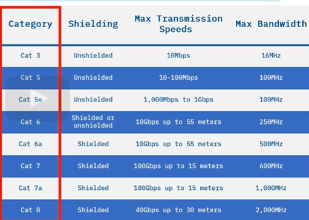

## Hard Drive Cables
> Hard drive cables like SATA, IDE, and SCSI connect a central processing unit or
CPU to a `device's main or default storage`.

> Hard drive cables connect a hard drive to a motherboard or controller card. The same cables may also be used to connect `optical drives and
older floppy drives`.

#### Serial Advanced Technology Attachment (SATA)
* Next generation cable SATA carries high speed data and connects to storage devices,
hard disk, optical, and solid-state drives.

#### Integrated Drive Electronics (IDE)
* Older interface that is a 40-wire ribbon cable
* Connects the motherboard on one-end and one or two devices on the other-end

#### Small Computer Systems Interface (SCSI)
* SCSI was designed to support a wide variety of device types. This means there are different types of SCSI cables.
* They may be ribbon cables or standard round cables of 50, 68, or 80 wires.
* Up to 16 devices including the motherboard or
SCSI controller card may be connected to one SCS cable

## Network Cables
> Network cables like `coaxial, fibre optics and ethernet (twisted pair)` connect devices & transmit data from one device to another

> Type of network cable used is determined based on `topology, size and protocols`

#### Coaxial

* Greater cable-length than twisted-pair (ethernet cables)
* 10Mbps capacity, uses `DOCIS standard (Data Over Cable Interface Specification)` which is a network standard used in systems that provide internet across cable TV lines.
* Common Types: `RG6 , RG59, F`.

#### Fibre Optics (Used in WANs)
* Different types of fiber optic cables are used depending on the `cost and the amount of bandwidth` the cable can support.
* 2 basic types of F-O cables: Single-Mode/Multi-mode

* Common fiber optic cable connector types include `LC, local connector, ST, straight tipped, and SC, subscriber connector`.

#### Ethernet (Twisted-Pair)
* Ethernet or twisted pair cables use the `T568A and
T568B` networking standards to improve signal communication.
* Hardwiring is faster-than `Wi-Fi`.

* Consists of category numbers where higher no = `faster and better bandwidth`.

* Common Ethernet cable connector types include `RJ11 and RJ45`.

## Serial Cables (Peripheral Cables)
> Serial cables like you might find on a `keyboard or mouse` are used for transferring power or data slowly over a distance.

> Follows the RSS-232 standard `data bits
must flow in a line one after another over the cable.`

* Used in: `Modems/Keyboards/Mice/Other peripheral devices`
* Eg: `USB-A, USB-C, USB Mini A`.

## Video Cables
> Video cables like `VGA, HDMI, mini-HDMI, DisplayPort, and DVI` transmit video signals from a device to a monitor, connects a specific type of `video port on a computer` to a display.

#### DVI
* DVID - supports only digital signals
* DVII - supports digital and analog signals
* Single-Link: 3.7 gigabits/s HDTV at 60 frames/s 
* Dual-Link: 7.4 gigabits/s HDTV at 85 frames/s

## Multi-Purpose Cables
> Multipurpose cables like `USB, USB-C, Lightning`, and Thunderbolt are used for fast data transfers, fast power transfers, and connecting devices `without a network connection`.

#### USB
* Connects to a wide variety of peripheral devices, supporting various speeds depending on the version
* USB 2.0/3.1/3.2/4
* Speeds from 480Mbps to 40Gbps
* Actual speed may lower depending on the device it is beig sued with

#### Lightning 
* Apple-proprierty
* They are used to connect Apple devices to USB ports. It can carry both data and power to charge the device.
#### Thunderbolt
* Apple-proprierty
* Copper-length: 3m, Optical-length: 60m

## Adapters
> Provides a way to connect different types of cables
* DVI to VGA adapters connect analog and digital devices.
* DVI to HDMI adapters connect older digital devices with newer ones.
* USB-C to USB-A adapters connect newer USB speeds and connect with older peripheral devices
* USB to Ethernet adapters provide Ethernet connectivity through USB port
