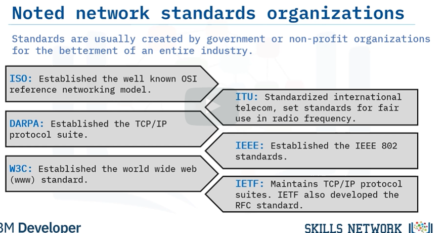
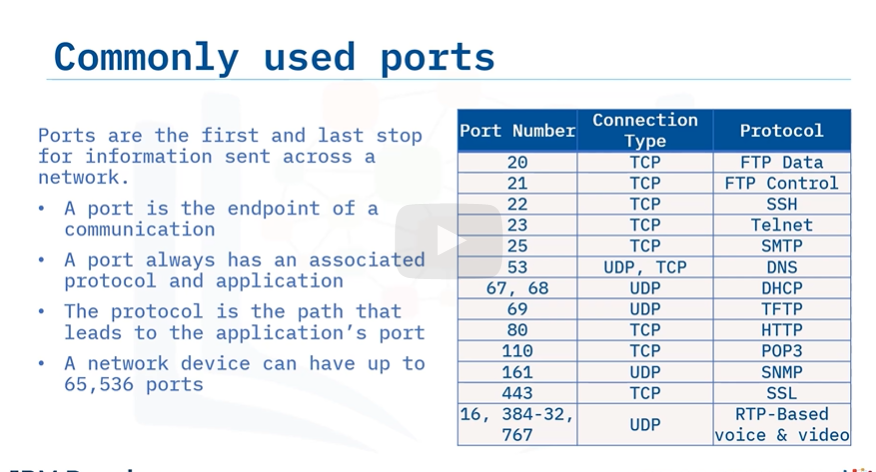

## IP Packets transmission mode

#### Unicast (One to one)
> Transmission to a single, specific destination

* Eg: Internet traffic such as HTTP/FTP

#### Anycast (One of the closest to many)
> Transmission to the closest node of multiple nodes that has the same unicast address assigned to them

#### Multicast (One to many) 
> Transmission to nodes that have subscribed to the same destination `multicast group address`.
* Relies on UDP (User Datagram Protocol)

#### Broadcast (One to all)
> Transmission to all nodes on the same subnet, for example to find a DHCPv4 Server
* UDP protocol over IPv4

## IPv4 and IPv6

#### IPv4
> Core protocol of the internet used to provide identification for every network device in the form of `IP addresses`
* Allows only around 4.3 billion IP addresses. (2^32 addresses)
* 32-bits because each IP address is 4 bytes `(4 bytes = 4 * 8 bits = 32 bits)`.

#### IPv6
> IPv6 is the newest version of Internet Protocol. IPv6 consists of 6 bytes
* It solves many of the limitations of IPv4, including address space and security.
* Ensures larger network capacity, with added efficiency and security features.

## IP address types

#### Static IP Addresses
> Manually assigned. Network servers or network
devices that have specific protocol settings often use Static IP addresses.

#### Dynamic IP Addresses (DHCP)
> Automatically assigned. They change every time the
device connects to a network or changes location.

#### Public IP
> Used to communicate publicly on internet

#### Private IP
> Used to connect securely within an internal private network and does not connect to internet

#### Loopback IP (Localhost)
> Range of IP addresses reserved for the localhost address.

#### Reserved IP
> Reserved IP addresses are addresses that have been reserved by the IETF (Internet Engineering Task Force) and the IANA for special purposes.

## Automatic Private IP Addressing (APIPA)
> Feature in operating systems like Windows that let computers `self-configure an IP address`
and subnet mask automatically when the DHCP server isn't reachable.

* If device is reachable in local network but not internet, chances are that it was assigned `an APIPA address`.

## MAC (Media-Access Control)
> Physical address of each device on a network
* Typically located in Network Interface Card (NIC)

> A MAC address usually consists of six sets of two digits or characters, separated by colons. 

> Technologies like `Wifi, Bluetooth, and Ethernet `use MAC addresses.

##### UAA: Universally Administered Mac Address
> Typically assigned to a device by its manufacturer

##### LAA: Locally Administered MAC Address
> Assigned to a device by software or network administrator, `overriding` the burnt-in address by the phyiscal manufacturer

> MAC Addresses handle the physical connection from computer to computer

> IP addresses handle logical network connection routes.

## Notable Network standards
> Standards are created in place for ensuring compatability and communication easily
* Can be split into De-Jure (Formal) standards: `HTTP/HTML/IP/IEEE 8.2`
* Or De-Facto standards that stemmed from the market place domination: `Windows, Qwerty keyboard`

## Ports

> A network device can have up to `(2^16 ports) or 65,536 (inclusive of 0)`, because source ports and destination ports take up to 16 bits on a packet header
* Port numbers do not change and a port is a communication endpoint
* Ports always have an `associated protocol and application`
* The protocol is the path that leads to the application’s port.
* Ports send and receive data using TCP, UDP, and sometimes both.

## Sockets
> Acts as a 2-way communication channel between application layer and transport layer
* Each socket is made up of:
1. Source IP addr
2. Protocol (UDP/TCP)
3. Port Number
4. Dest IP addr

> You use a socket whenever you send data over your local network or over the Internet.

Example: Sending an email online
> Source IP + HTTP (Protocol) + Port 80 + Dest IP