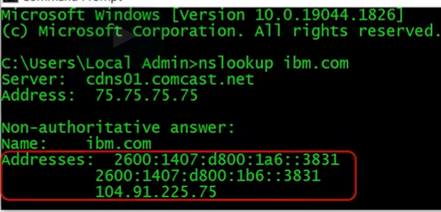

## ipconfig
> ipconfig shows the information and status for network adapters in a system.

For configured adapters, ipconfig shows:
* IP address, subnet mask, and the default gateway.

Non-configured network adapters would show as:
* Media disconnected

## ping
> The ping utility sends an echo request to another computer to see if an echo reply message
is received. Checks to see if data can be sent or received

* One is able to `ping` both `IP addresses and domains`.
* If you ping your computer’s loopback address and get a reply, that means your network interface
card is working properly.

## nslookup
> Nslookup is a command line utility used to find the IP address of a domain or host.

Queried domain and IP address is listed under `non-authorative answer`.

## tracert
> The tracert utility is similar to the ping utility, except that it follows or “traces”
the route a data packet takes to its destination instead of just tracking start and end points
of a connection.
* Every packet sent has a different `TTL`, where each packet decreases its `TTL` at each node, so that a reply is received from each node to track the path

> Firewalls affect tracert tests, causing a `request time out` message

## netstat
> Netstat, short for network statistics, is a command utility that shows if a server’s
email and file-sharing ports are open and connecting to other devices.

netstat lists a connection’s:
* Protocol, Local address, Foreign address,
And current state

> Netstat is useful when you want to find where a problem is in a network. It identifies errors
and provides robust diagnostics information that can be used in further troubleshooting.