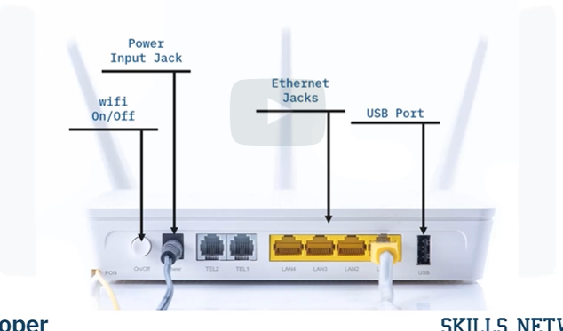

## SOHO (Small Office Home Office Network)
> Local area network, or LAN, with `less than
10 computers` that serves a small physical space with a small number of employees or home users.
* Can be a `wired ethernet LAN` OR a LAN made up of both wired and wireless devices

#### Wired SOHO networks
Includes:
1. Router with a software-based firewall
2. Switch with 4 to 8 Ethernet LAN ports, 
3. a printer, and several desktops or laptops.

> SOHO networks often use email, website, and cloud subscription services since maintenance
and reliability are included

> Internet is provided via `cable, DSL, or ISDN`. Basic equipment maintenance is easy since there are only a handful of devices and cables to consider.

## Configuring SOHO networks

#### Compatability
> Need to ensure that in setting up a SOHO network:
* Hardware/Software/Adapter Cards and cables need to be `compatible` for the network to run successfully

#### Gathering Hardware
> SOHO networks `need a switch` to act as the hub of the network. If Internet is desired, a router can be added or used instead.

SOHO networks tend to have other integrated features:
1. `Modem` - provides an internet connection by using coaxial cables to receive internet from ISPs. We typically connect Modems to routers via `ethernet cables`.
2. `Ethernet` - provides a wireless connection
3. `Router` - automatically assigns IP addresses to each device on a network (DHCP). Acts as a go between for modems and network devices if the network `has internet connection`.
4. `SOHO Network Switch`- allows 4 to 8 devices to communicate and talk to each other but does not allocate IP addresses or provide internet connection
> Switches are `best used` to expand the number of LAN ports on a network as the number of ports on `a router` can be limited

#### Connect hardware
1. Plug switch or router into a power source
2. Connect the switch to the router (if necessary)
3. Plug one end of an Ethernet cable into `any LAN port on the router` and the other `into any LAN port on the switch`. This will expand the network to the rest of the LAN ports on the switch.
4. Connect your modem to the router (if necessary)
5. If you're sharing an Internet connection from a modem, connect the modem to the WAN/INTERNET
port on the router. This is usually a `different color` than the other ports.
6. Connect your computers to open LAN ports. Use Ethernet cables to connect each computer to any
open LAN port on your router or switch.
7. Keep devices close to the router or switch since
Ethernet `doesn’t transfer data reliably` over long distances (100 meters maximum).

#### Configure router settings
1. Type `ipconfig` in command prompt and search for the IP address under `Default Gateway` section
2. Enter that ip address into any browser
3. From there will be able to login with username and password to configure
4. After setup, if you cannot access the Web, the router is not connected. This is usually caused by choosing the wrong broadband connection type for your service.

## Wireless SOHO network
> SOHO wireless network is a wireless local area network, or WLAN that serves a small physical space with a small number of employees or home users.

> A SOHO wireless network can be configured with
the help of a `central wireless access point,
or WAP`, which can cover a range of wireless devices within a small office or home.

> WAP uses ethernet to connect to the router

#### Common Broadband Types

#### Dynamic Host Configuration Protocol,
> DHCP is the most common broadband type.
It is used in cable modem connections.

#### PPPoE, or Point-to-Point Protocol over Ethernet
> Used in DSL connections
in areas that don’t have newer options.

#### Static IP 
*  more common in business.

> DHCP is the easiest broadband type to use. Internet Service Providers can provide other options if needed.

## Router 

## SSID (Service Set Identifier)
> Name of a wireless network that is chosen during the setup of the network and can be changed in router settings

> It’s a good idea to choose a unique name
to distinguish your router from any neighboring wireless routers nearby.

> Each country determines the band usage and the available 802.11 Modes.

* The supported modes for the 2.4 GHz band are 802.11 (b/g/n).
* The supported modes for the 5 GHz band are 802.11 (a/n/ac).
* Every router has a default option that supports all types

## Wireless Encryption Security Modes

#### Wired Equivalent Privacy (WEP)
> First security protocol developed. It was retired due to security flaws. It is only in use now when equipment is old or not updated.

#### Wireless Protected Access (WPA)
* Stronger than WEP, and supports a wide variety of devices

#### Wireless Protected Access 2 (WPA2)
* Strongest of the 3
* Supported on newer wireless devices
* Most common and most secure

#### Configuring encryption for wireless network
1. Select the WPA2 security mode.
2. Set your “Pre-Shared Key”. This is your WPA password. It must be 8 to 63 characters long.
3. Once the router is configured your wireless network is ready.

## IMEI vs IMSI
> Used to identify cellular devices and network users when troubleshooting device and account issues.

#### International Mobile Equipment Identity (IMEI) 
> unique number for phones on the GSM, UMTS,
LTE, and iDEN networks.  It can be used to block stolen phones.

#### International Mobile Subscriber Identity (IMSI) 
> Unique number for cell network subscribers. It is usually stored in a device’s SIM card.