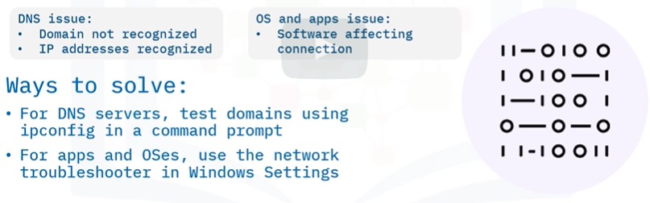

## Connectivity Problems
* Can't Connect
* Slow Connection
## Causes of Connectivity problems

#### Cable damage.
> Cable damage slows or stops network connections.
The damage can be obvious or hidden from view.

Fix: Check for physical damage, Test the cable using different devices or a specialized tool. Replace the cable.

#### Equipment malfunction.
> Equipment malfunction can slow or stop network connections.

Fix: 
* Check the network adapter drivers in Device Manager.
* Make sure your switch’s port settings are correct in the management software.
* Or, replace the malfunctioning equipment

#### Out of range.
> When a user is too far away from a wireless signal, their connection will lag or fail.

Fix:
* Move physically closer to the source of the wireless connection.
* Move the wireless connection source closer to the affected users.
* Use stronger devices to boost the signal strength,
* Use more devices to ensure the wifi reaches users who are farther away.
#### Missing network name or SSID.
> Network connections can fail when a user can’t find the network name (or SSID) in the available
network list.

Fix:
* Move physically closer to the `Wi-Fi` Source
* Reconfigure the network to ensure the SSID is not hidden.
* Upgrade devices or use compatibility mode on newer networks so older devices can still
connect. (Note that compatibility mode can slow an entire network). To correct this, reserve the 2.4 GHz band for legacy devices.

#### Interference.
> When a radio or microwave signal slows or breaks a wireless connection.

Fix:
* Remove the source of the interfering signal.
* If on a wireless connection, use a different wifi frequency.
* If on a wired connection, use shielded cables to connect.
* Or remodel the building with signal-blocking materials.

#### Weak signal.
> When signal strength is weak, a wireless adapter might slow speeds down to make the connection
more reliable. This is one reason why `fast hardware` lags

Fix:
* Get closer to the wireless signal.
* Adjust the wireless frequency channel.
* Or physically realign devices and antennas for better reception.

#### DNS and Software malfunction.
> Network connections can fail when DNS servers and apps and OSes are configured incorrectly.

#### Malware.
> Slows or stops network connections intentionally, or as a result of overloading a system with other tasks

Fix:
* Antimalware tools in Windows Security.
* Adjust firewall settings in Windows Settings.
* configure privacy settings in Windows, and in your browser and email applications.