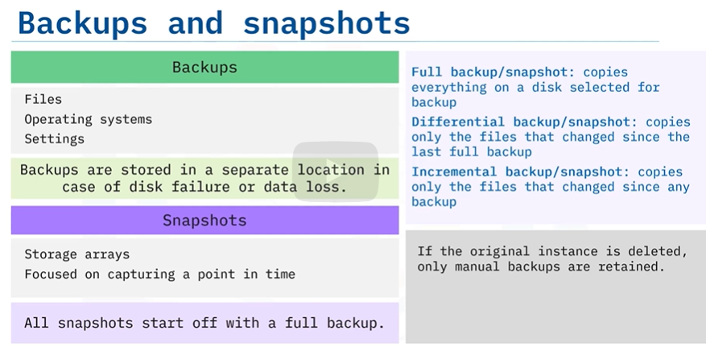

## Cloud Storage Types

#### Public Cloud
> Provides `offsite` storage for internet users

#### Private Cloud
>  Provides collaboration and access to private network users

#### Hybrid Cloud
> Combination of both. It provides public sharing
and restricted private areas via cloud storage and cloud-hosted apps.

## Cloud Storage Types
> Cloud companies use multiple data storage types
depending on how often they need to access different data and the volume of that data.

#### File Storage
> File storage saves all data in a `single file` and is organized by a hierarchical path of folders and subfolders. File storage uses app extensions like .jpg or .doc or .mp3
* Provides a familiar interface
* Supports sub-folder environment
* Supports zip-files and usb transfer
* Has user-customization and is `expensive`.
* Provides low scalability

#### Block Storage
> Block Storage splits data into fixed blocks and stores them with unique identifiers.

> When a block is retrieved, it’s reassembled with
associated blocks to `recreate` the original data.

* Provides fast, reliable storage and is easy to change
* Stores data across environments (Eg: one block in `Linux` and one block in `Windows`)
* Updates large data amounts frequently and within seconds
* Used in databases and email servers
* Has no metadata, not searchable and is `expensive`.

#### Object Storage
> Object Storage divides data into self-contained units stored at the same level. There are no sub-directories like in file storage.

* Supports large unstructured data backups and collections
* Uses metadata for fast keyword search
* Each object has a unique number
* Requires an `API` to access and manage objects
* Provides excellent scalabilty for AI, machine learning and big data analytics
* Stores log files

## Storage Gateway
> Service that connects on-premises devices with cloud storage.

#### File gateway
> File server in the cloud that stores data files using the:
* S3 (Simple Storage Service Protocol)
    * Enables the storage of block data in categories called “buckets.

* NFS (Network File System Protocol)
    * Enables `server-to-server` file sharing.
* SMB (Server Message Block)
    * Enables file and print sharing for network users

#### Tape Gateway
> A backup server in the cloud that stores backups via virtual tapes

> Glacier and Glacier Deep Archive protocols enable secure and durable cloud-archive storage
at a lower cost than other storage solutions

Uses:
* S3 (Simple Storage Service Protocol)
    * Enables the storage of block data in categories called “buckets.

* Glacier 
    * Features instant archive retrieval 
* Glacier Deep Archive
    * Features 12-48 hour data retrieval

#### Volume Gateway
> Enables data transfers between cloud and on-premises
*  Uses the `Internet Small Computer System Interface (iSCSI protocol)`, which enables on-premises applications to transfer block data to
cloud storage over TCP/IP networks.
* Have 2 modes: Stored and cached mode
* `Stored mode` - creates S3 backups of all locally stored content for recovery purposes.
* `Cached mode` -  just like stored mode, except it only keeps frequently-used data
on-premises, which requires much less infrastructure.

## Archival Storage (AS)
> Moves data out of regular production file areas into `long-term storage`. Archival storage can be easily accessed and brought back into regular use.

Can be done with:
* Tape drives - best for large backups
* Flash storage
* Hard Drives
* Cloud solutions

> AS is low cost and high-capacity

## Backups & Snapshots

> Backups & snapshots can be `automated or manual`
* Best to keep 3 data backups/snapshots for any important data
* Sometimes data can get corrupted. Backups and snapshots should be tested periodically to ensure they are still able to restore the data.