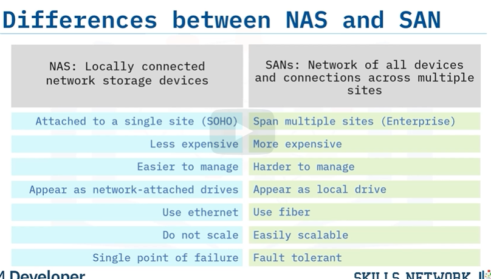

## Storage as a Service (STaaS)
> Basically when companies sell their network storage to customers so `that customers` dont have to purchase and maintain their own network equipment

Examples: DropBox, OneDrive, Google Drive, Amazon Drive & Box

## Email & Social Media Storage
> Companies have varying security & data retention policies when it comes to saving your data such as `social media posts` or `email`

Eg: 
* Google permanently deletes recently deleted email after 30 days
* Facebook deletes after 90 days but keeps certain user data `indefinitely`.

## WorkGroup/HomeGroup
> A workgroup or homegroup is a group of computers on a SOHO network, typically `without a server`.

To share files on a homegroup network:
* Users set file sharing to `public`
* Data is stored on the `user device` that created it
* The added points of failure create higher risk of data loss.
* Newer Cloud solutions provide the same features more securely.
* Homegroups have been removed from Windows 10 altogether.

## Repository
> A repository is a `network location` that lets users store, manage, track, collaborate on, and control changes to their code

* Repositories save every draft and users can roll things back if problems occur. (Allows users to revert back to earlier version)
* This can save software developers months of time.

Eg: Github/Docker Hub

## Active Directory
>  Microsoft technology that manages domain elements
such as users and computers.
* Organizes domain structure
* Grants network access
* Connects to external domains
* Can be managed `remotely` from multiple locations

#### Active Directory Domain Services (or AD DS)
> Are the core services behind Active Directory.

AD DS:
* Stores centralized data & manages communication and search
* Authenticates user so that they can access encrypted content
* Manages SSO (Single-Sign on) user authentication
* Limits content access via encryption

## Network Drives
> Network drives are installed on a network and shared with `selected users`. They offer the same data storage and services as a standard disk drive
* Can be located anyway
* Appear alongside mobile drives
* Can be installed on computers, servers, NAS units or portable devices

## Network & File Sharing
> File and Printer Sharing is part of the `Microsoft Networks` service. It allows computers on the network to access shared files and printers.
* Network drives appear alongside local drives or are accessed via a web browser
* Network printers appear in the printer options popup.
* Provides common `centralized` resources to users on a network

## Network Storage Types
> Network storage is digital storage that all users on a network can access

* Small networks may rely on `a single device` for the storage needs of 1-5 people.
* Large networks (like the internet) must rely on hundreds of datacenters full of servers.

## Storage Area Network (SAN) - large networks
> SAN combines servers, storage systems,
switches, software, and services to provide secure, robust data transfers.
* Have better application performance.
* Are central and consolidated.
* Are offsite so data is protected and ready for recovery.
* Include simple, centralized management of connections and settings.

## Network Attached Storage (NAS) - small networks
> NAS, device is a local file server. It acts as a hard drive for all devices on a local network.
* Convenient sharing across network devices.
* Better performance through RAID configuration
* Provides remote access
* Works when the Internet is down.

## NAS vs SAN

> NAS and SAN are different because NAS is
local to its network while a SAN is a storage system that spans multiple offsite locations
and involves many devices, servers, and connections.