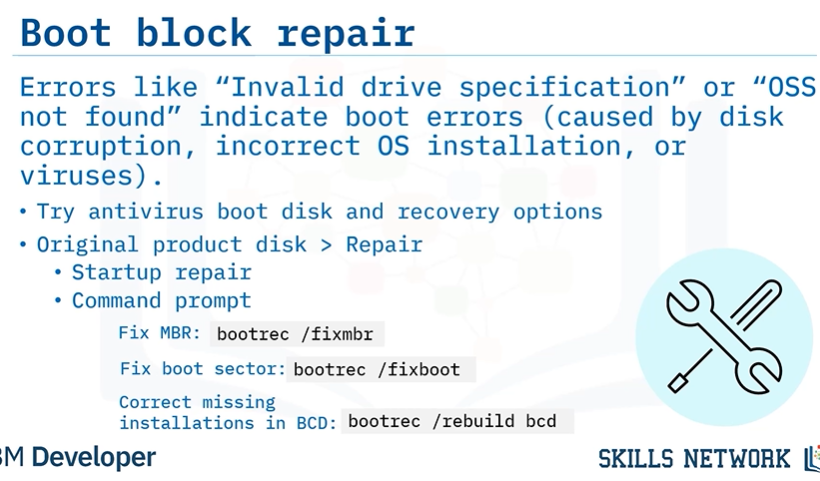
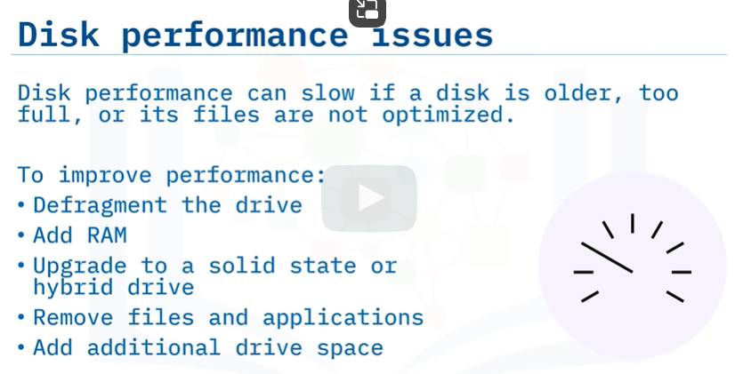
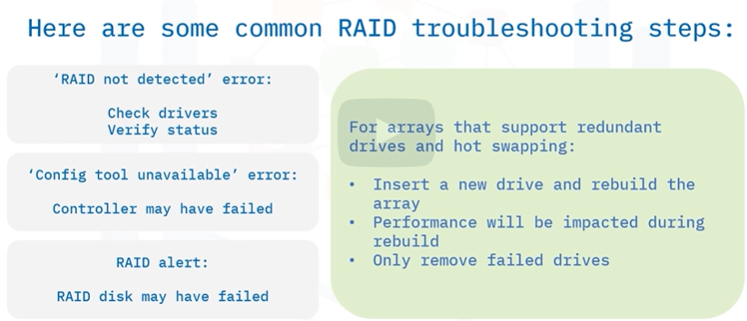

## Disk Failure Symptoms
> Disk failure or hard drive failure can be caused by wear and tear over time, faulty manufacturing, or power loss (especially when the disk is reading or writing).

Symptoms:
1. Read/Write Failure - error message when you open or save a file
2. Blue Screen of Death (BSoD) 
3. Bad sectors error means that part of a disk is unreliable and needs to be fixed.
4. Disk Thrashing - Constant LED activity (or disk thrashing) may indicate insufficient RAM, with data moving back and forth between RAM and the hard disk.
5. Clicking and grinding noises

> Best to replace disks upon such symptomps to avoid disk failure

## Troubleshooting tools
> The chkdsk tool and the SMART program are used to monitor and troubleshoot disk health.

#### SMART (Self-Monitoring and Analysis Reporting Technology)
> Sends an alert when the disk is unreliable
```sh
wmic/node: localhost diskdrive get status # gives status of disk
```

#### Chkdsk 
> A check disk run test (chkdsk /r) locates bad sectors each time it is run. 
* Recall that bad sectors are `unreliable parts` of a disk
* Needs administrator rights 
```sh
chkdsk /r # locates bad sectors each time it is run
chkdsk /f # fixes file system errors but wont find bad sectors
```
## Boot Failures
When a computer fails to boot:
1. Check for lights associated with power button
2. If these do not come on, check if the device is plugged in

If the device powers up but still does not boot:
1. Check the drive configuration to ensure
that: Firmware system setup has the correct boot
sequence, and no removable disks are present.
2. Data cables are connected to the drive correctly and free from damage.
3. Motherboard port is `not disabled` by system setup.

If the drive configuration is fine, it may be a filesystem error.



## File Recovery Options
> For computers that won’t boot, you can try to recover files by removing the hard drive
and connecting it to another computer.

External enclosure kits let you secure the removed drive and connect it to other computers
using a USB cable.

Recovery Options: 
* Inspect and recover the drive’s files via `Windows Disk Management`.
* use chdsk to restore fragments of corrupted files
* Keep in mind that third-party file recovery software may work better.

## Disk Performance Issues



## Troubleshooting Optical Drives
> Optical drives are laser-based and don’t physically touch disks.

Tips:
1. Cleaning kits can often resolve common read/write
errors.
2. CD-ROM drives cant read DVD-rom and blu-ray
3. Third-party software is available for DVD and Blu-Ray disk support.
4. Writable disks have recommended write speeds that affect quality and vary depending on
the brand.

#### Buffer-Underrun 
* (OS is too slow for optical disk drive process)

Fix using:
1. Latest CD & DVD writers
2. Burn at a lower write speed.
3. Close all other applications when burning, 
4. or copy data to the hard drive instead of
to disk.

## Troubleshooting RAID (Redundant Array of Independent Disks)

> Removing healthy disk can also cause `raid array to fail`

> If too many disks fail, use backup and recovery solutions.

> A non-redundant RAID failure (like RAID 0) means both disk and data are lost.

? If the controller fails, install a new controller or import the disks into another system.