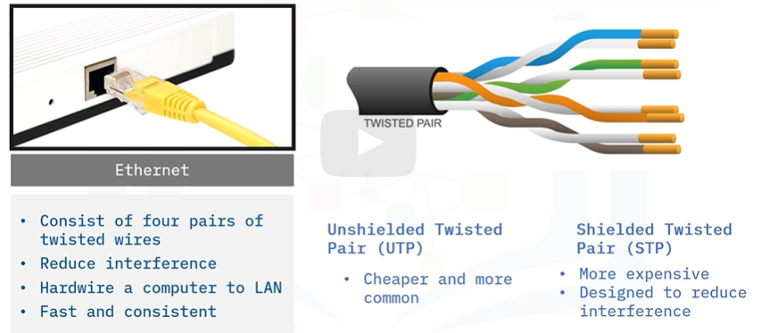
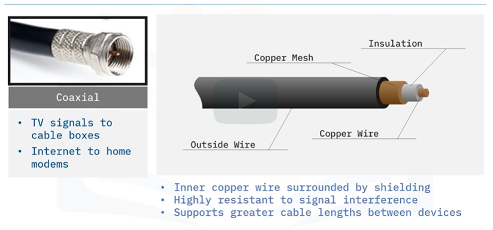
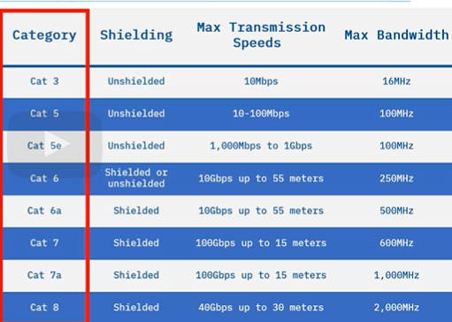
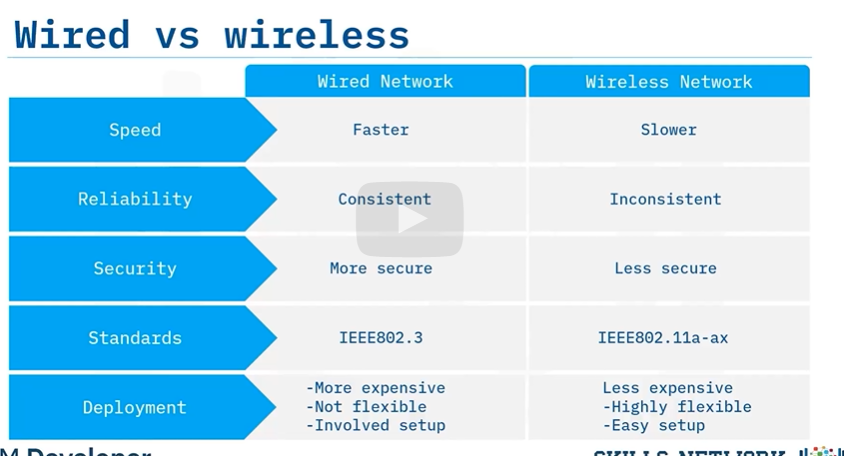

## What is a computer network?
> Computer networking refers to `connected computing devices` like laptops, servers, and smartphones and an ever-expanding array of IoT devices like security cameras, door locks, doorbells, refrigerators etc

> Computer networks enable data transfer and resource sharing through emails,files, documents, databases, and notifications amongst multiple users.

## Network Types

#### Personal Area Network (PAN)
* Enables communication between devices around a person
* Can be wired or wireless
* Examples: USB/Firewire/Infrared/ZigBee/Bluetooth
* Range from few cm to metres
* PANs are also used to connect laptops, tablets,
printers, keyboards, and other computerized devices.
* Eg: Connection between bluetooth earpiece and smartphone

#### Local Area Network (LAN)
* Local Area Network, is typically limited to a small, localized area, such as a single building or site.
* A LAN is a group of computers and peripheral devices that share a connection to a server.
* A LAN may serve two or three users in a home office, or several hundred users in a corporation’s central office.
* LANs enable network devices to share resources like printers or network storage.
* LANs require cables, switches, and routers so users can connect to internal servers, websites, and other LANs.

#### Wireless Local Area Network (WLAN)
* Wireless LAN, links two or more devices
using wireless communication to form a LAN within a limited area, 
* such as `a home, school, computer lab, campus, office building`
* Through a `gateway device (router)`, a WLAN can also provide a connection to the wider Internet.
* WLANs are used in smartphones, tablets, laptops, and gaming consoles.

#### Metropolitian Area Network (MAN)
* Metropolitan Area Network,is a network that spans an entire city, a campus, or a small region.
* MANs are sometimes referred to as CANs (Campus Area Networks).
* A MAN is optimized for a larger geographical area than a LAN, ranging from several building blocks to entire cities.
* A MAN is typically formed from connecting several LANs
* Eg: `cable tv networks, telephone networks or any free or public wifi system provided to city residents`

#### Wide Area Network (WAN)
* Wide Area Network, is a network that extends over a large geographic area.
* Often established with `leased telecommunication circuits`
* Often used by Schools, Businesses and Government entities to relay data from almost anywhere in the world
* Eg: `The internet`

#### Virtual Private Network (VPN)
* Virtual Networks are `software-based`
* They control and direct communication across `existing physical networks`.
* Any physical network location can be assigned to a virtual network by a `network administrator`.
* Virtual networks make network administration easier, increase network efficiency, and improve security.

* Virtual Private Network, establishes a `private or protected` network connection across public networks.

It provides the following benefits:
* Encrypts your Internet Traffic
* Disguise your `online identity`
* Safeguards your data to prevent `unauthorized eavesdropping`
* Encryption takes place in real time and ensures
that sensitive data is securely transmitted.

#### Virtual Local Area Networks (VLAN)
* A network made up of `locations` from other networks
* Software-based
* Separate larger networks into smaller groups,
and they `do not require` users to be in the same physical space.
* VLANs are useful when you want to share data securely.

> Employees from different groups in a large company can each be assigned to a specific
VLAN, which will allow them to securely collaborate and share data with each other.
## Network Topology
> Describes the layout of the network structure

### Physical Topology
* Describes how network devices are `physically connected.`
* Example: Star, Ring, Bus, Tree, Mesh

#### Star Topology
* Involves a `central computer` that acts as a hub
* Each device connects to the `hub` through a cable known as the `backbone cable`
* `Most commonly used physical topology`

#### Ring Topology
* Connects all devices in a circular pattern where data only flows in 1 direction `clock-wise`.
* Each device sends the data in a circular motion until it reaches the `intended recipient`
* Typically used in a small office with a few nodes
* Another adaptation of this would be `token passing` where nodes can only speak when they have the `token` 

#### Bus Topology
* Bus topology networks connect all devices with a `single cable or transmission line`.
* This cable functions as a shared communication channel that devices can tap into without a separate network connection device.
* Mainly suited for small networks such as `LAN`
* Often as a network engineer, you have to also design an algorithm such that each node will not cut each other off when `communicating`.

#### Tree Topology
* Tree topology networks combine the characteristics of bus topology and star topology.

* Typically used in campuses where there is a hierachical fashion where each building
has its own star network, and all the central computers are linked in a campus-wide system.

#### Mesh Topology
* All computers on the network are `connected together`
* Each computer has a special mesh-software installed for the purposes of calculating the fastest path to the `intended recipient`
* Also known as dynamic routing (I would think this has some sort of correlevance to `distance vectors algorithm for routing protocols`)
* Mesh topology is commonly used in WAN for backup purposes and not used in `LAN`
* Eg: Commonly used in internet

### Logical Topology
* Describes how `data flows` across the physically connected network devices.